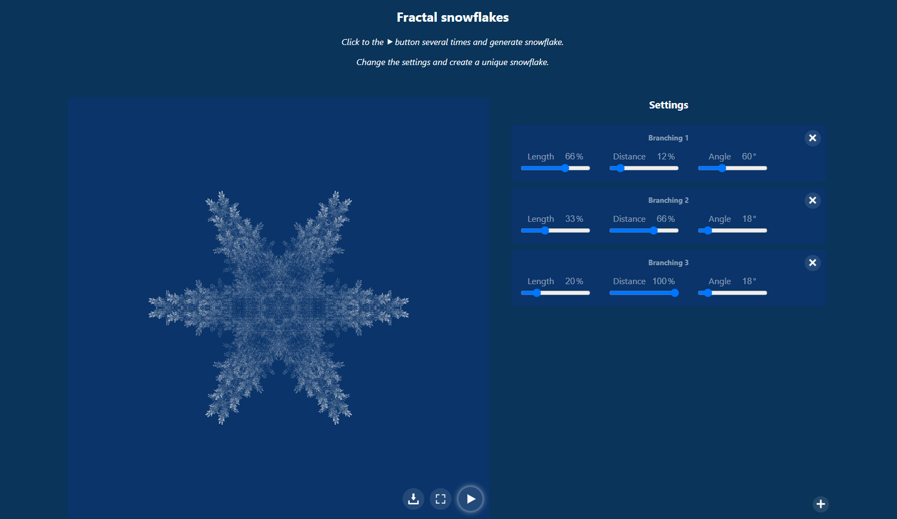
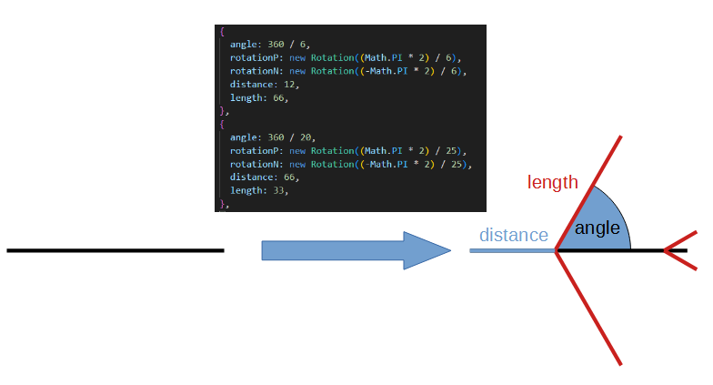

# [Fractal snowflake](https://pmerka.github.io/snowflake/)

The Fractal Snowflake Generator is a web application that allows you to create beautiful and intricate snowflake patterns using the power of fractal geometry. With this application, you can generate mesmerizing snowflake designs and explore the fascinating world of fractals.

## Code
This project is divided into two main parts: the JavaScript fractal logic and the React UI.

The Drawing class in "snowflakeGenerator.js" serves as the central class for the animation. When the application starts, the Drawing class creates a new branch by instantiating an object from the Branch class (branch.js file). Each Branch object has the ability to draw itself on the canvas and generate new branches (based on parametrs).

